# 一、功能介绍
## 1. 简介
在 c++ 项目中，目前仍然还是以 *头文件、源文件分离* 为主，在头文件中写声明，源文件中写定义。这就存在一个重复工作: 
> 一个函数需要写两遍，还可能需要 删除参数的默认值、加上类作用域、命名空间等

htf 命令行工具的作用就在于 **自动读取头文件，将定义语句输出到源文件中** (我将此功能叫做 htf)。

## 2. 简单演示：
### i. 单文件处理：
- 头文件如下：        
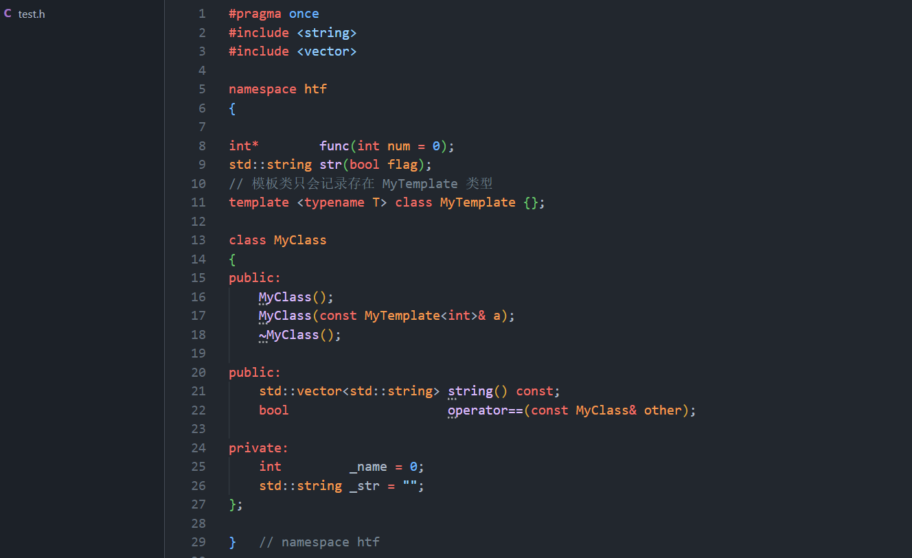

- 使用指令调用: *htf  test.h  -o test.cpp*         
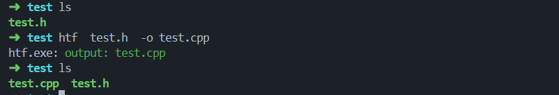

- 源文件输出如下：              
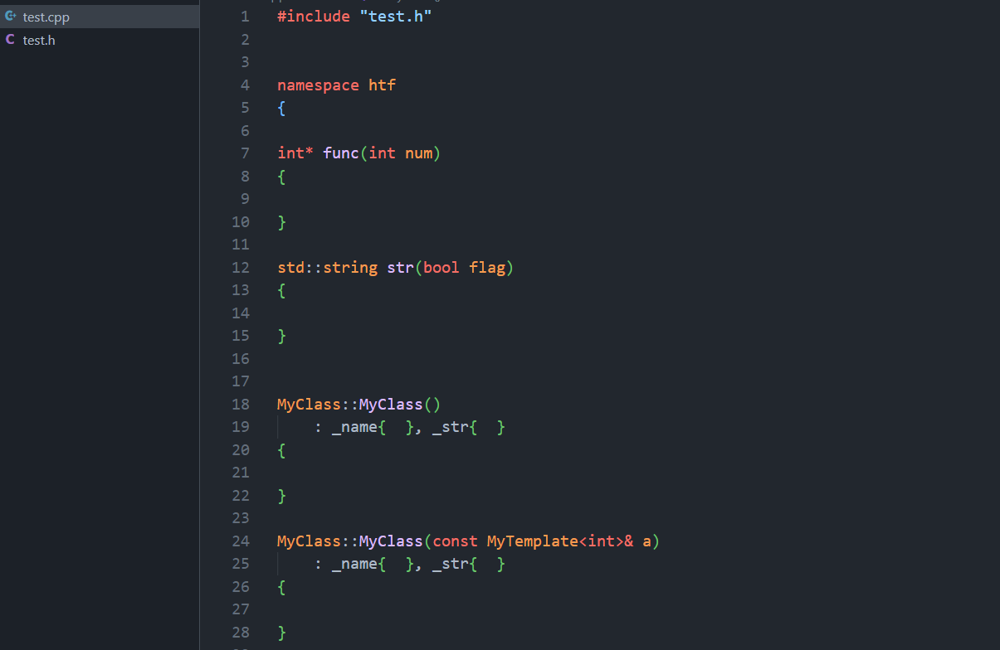
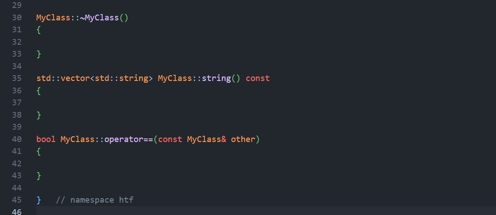

### ii. 多文件处理：
- 有三个头文件如下：        
    - type.h: 声明了一些类型        
    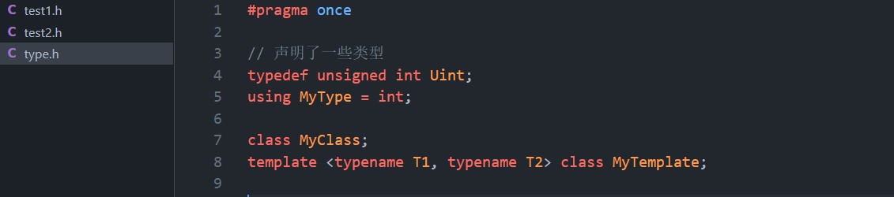

    - test1.h: 导入 type.h，声明了类型 Test1        
    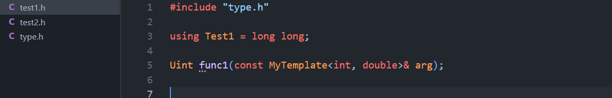

    - test2.h: 导入 test1.h     
    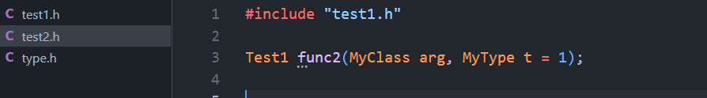

- 指令调用: *htf  te\*.h  -o .*     
    > 相当于: *htf  test1.h test2.h  -o .*

    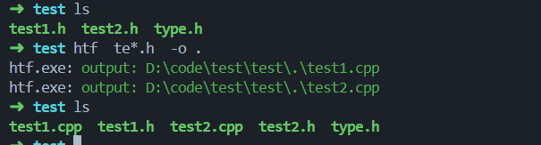

- 源文件如下：
    - test1.cpp
    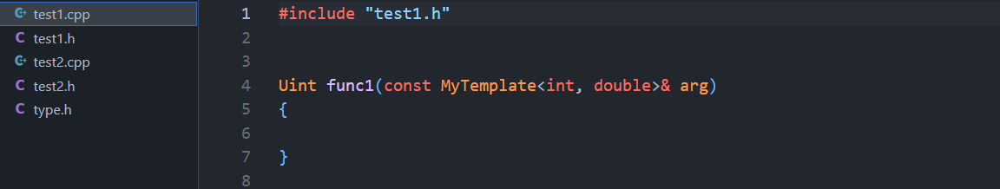
    - test2.cpp
    

## 详情功能：
- 自动 **删除函数默认值**
- 自动添加为类的构造函数 **添加初始化列表**
- 自动为类成员函数 **添加类作用域**
- 自动 **忽略** 头文件中的 **定义语句**
- 自动 **添加命名空间**
- 实现了简化版的 **预处理器**
    - 目前仅处理 续行符 与 #include 指令
    - 后续待扩展
- 有一定量的代码错误提示
> 仅仅提供有必要的错误提示，因为这是 c++ 编译器的工作
- other ...

# 二、工具下载

见 release 处

# 三、工具使用
此工具采用 **指令调用** 的方式，指令格式基本同 **g++ 编译指令**。

## 1. 约定 
- **[ ]**: 表示 [ ] 中的部分可有可无
- **中文**: 其意思表示当前位置应该输出什么
- **英文**：表示此处是 htf 指令中指定使用的字符
- **集合**：指明集合的说明可以有多个值，未指出的说明只能由一个值

## 2. htf 指令
- htf 处理文件:
    - 指令：*htf 头文件集合 [-o 输出路径] [-I 头文件搜索目录集合] [-f]*
    - 说明:
        - 头文件集合：需要输出的头文件的路径 (支持通配符，见后续)
        - 输出路径：
            - 头文件只有一个，则可以指定为 源文件输出的具体路径
            - 头文件有多个，只能指定为 源文件集合 输出的目录 (默认文件名同头文件名，只是后缀是 .cpp)，默认在当前目录下输出
        - 头文件搜索目录集合：指定头文件的搜索目录，默认使用头文件所在目录 (支持通配符，见后续)
        - -f：
            - 省略：当源文件已经存在时，仅给出警告，不做任何处理
            - 给出：当源文件已经存在时，**覆盖** 源文件
            > 需要慎重使用
---

- htf 显示选项的值
    > 加入选项 *-s*，仅显示选项的值，不做任何处理

    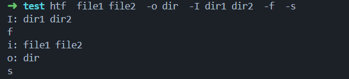

- help: 
    - 指令: *htf -h*  
    - 输出 htf 指令中的选项信息
    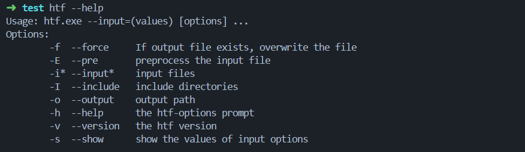

- version:
    - 指令：*htf -v*
    - 输出当前 htf 版本

- htf 预处理器
    > 增加 *-E* 选项，其余同 *htf 处理文件*，但是一次只能指定一个头文件，默认输出的文件后缀名为 *.i_htf*

## 3. 通配符规则：
- **\***：匹配任意多个字符
- **\?**：匹配任意一个字符
> 以上通配符都 **不能匹配路径分隔符**

【例】
- *\*.h*：可以匹配 *file.h*，但是不能匹配 *dir/file.h*
- *\* / \*.h*：可以匹配 *dir/file.h*，但是不能匹配 *file.h*
> **如果需要匹配目录，则在最后加上路径分隔符**，不添加只能匹配文件路径

【例】
- d * /：可以匹配当前目录下所有以 d 开头的目录
- ./dir/*/：匹配当前目录下的 dir 目录下的所有目录

# 四、项目信息
- C++ 标准： c++17 (\<filesystem>)
- 开发平台: windows 下的 VScode
> 就代码而言跨平台(项目仅使用 c++ 标准库)，但未经过正式测试
- 构建工具: cmake
    - Release: cmake .. -DU=1
    - Debug: cmake .. -DD=1
    - Test: cmake .. -DTEST_BUILD=1

- 编译器: g++
> 其他编译器未经过测试

# 五、可能出现的问题
- htf 输出代码错误信息，但是语法是正确的
> 语法以编译器为准，由于 htf 对 c++ 的语法不是完全支持 (**目前仅支持常用语法**)，因此可能出现此种情况
- htf 处理文件，有的声明函数没有输出定义语句
> 如果不是文件由于语法错误，那么是 htf 的 bug
- 出现 以 *.i_htf*、*.htf_temp* 为后缀的文件，"htf_temp_dir-BLR-header_to_file-htf-jiangmeng-0123" 目录，这些是 htf 处理过程中的临时文件。
> 如果出现此种情况，那么是 htf 的 bug，这些文件、目录都可以直接删除

**如果出现以上问题 或者 其他 bug，请联系开发者**