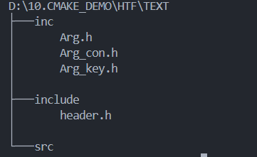
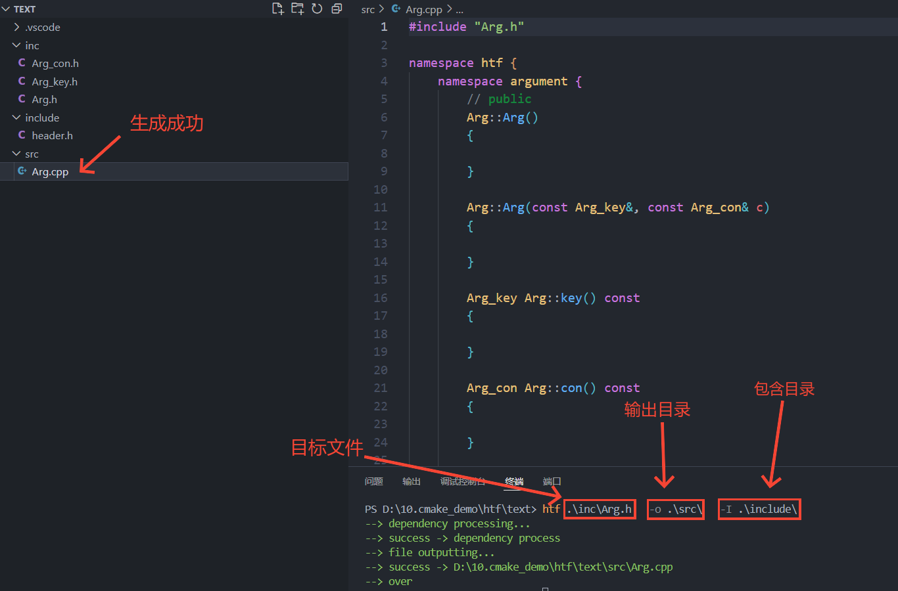
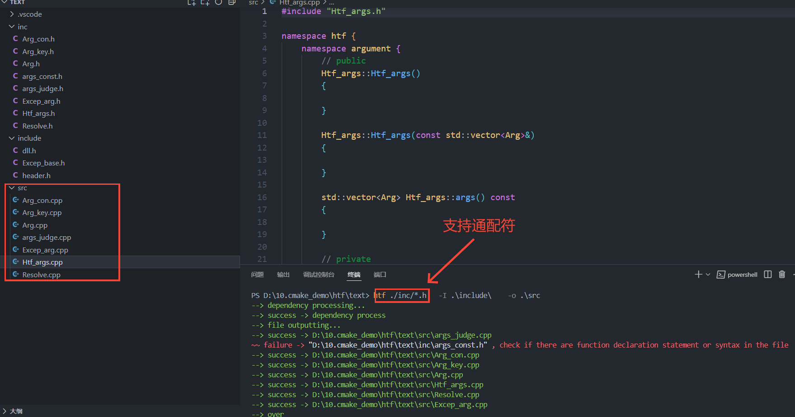

# Header_to_File
***

### 安装教程   

#### 方案一：
**发行版** (电脑端页面右侧) 提供 windows系统 的 htf-x64_win 压缩包，只需下载后解压即可使用
#### 方案二：
通过 cmake 构建 (g++编译)
- 下载源码到本地，在 ./build/ 目录下依次执行
> cmake .. -G "MinGW Makefiles" -D U=1        
> make install
- 即可自动生成 htf-install 目录，工具位于 htf-install/bin/ 目录下
> 


### `[建议]`        

因为此工具使用的是指令调用 (类似 g++)，因此建议 **将 htf 所在路径加入环境变量**，如此之后可以在任意目录下使用指令调用 htf

***

### 介绍
#### 1. 主要功能：
根据头文件中函数声明语句，自动生成包含对应定义语句的源文件的命令行简易工具。 (以下此功能统一称为 " htf " )

#### 2. 优点：
在写完C++头文件中的声明语句后，不用重写或者copy，直接一条指令生成对应的包含定义语句的源文件，从而专注于代码实现

#### 3. 功能详情及限制：       
(1) 仅支持使用**C++语法**的头文件  
(2) htf 指令    (后面有详解)
>        htf   [-f]   [-i] target_file   [-o output_dir]   [-I include_dir]   

> - 支持通配符匹配路径 (目前存在一定限制，见最后): 
> - `与 g++ 编译指令类似`

(3) htf 功能
- 支持**处理头文件依赖关系** 
> 目前仅支持处理 **#include "xxx"** 指令

[例] 目录结果如下: Arg.h 依赖于 Arg_con.h 、Arg_key.h，后者又依赖于 header.h。输入指令 'htf Arg.h -I inlcude'，那么 htf 会自动处理其中的依赖关系     


- 一般函数声明语句 (类外函数)
> - 支持**识别命名空间、自定义类型**
> - 支持**跳过定义语句，忽略函数参数默认值**
```cpp
typedef struct{} A;

std::string str(const std::string& s = "", char c = ' ');

std::istream& operator>>(std::istream&, A&);

//  --htf-->  

std::string str(const std::string& s, char c)
{

}

std::istream& operator>>(std::istream&, A&)
{

}
```

- 类的成员函数
> - 支持分类识别 public、protected、private 下的函数
```cpp
class A {
public:
    A();
protected:
    char* str_c() const;
public:
    std::string str() const;
private:
    std::string _val;
    void _fic();
};

// --htf-->  

// public
A::A()
{

}

std::string A::str() const
{

}

// protected
char* A::str_c() const
{

}

// private
void A::_fic()
{

}
```

**c.** 支持 namespace 
```cpp
int fic();

namespace A {
    int[] a();
    namespace B {
        int** b();
    }
}

// --htf--> 

int fic()
{

}

namespace A {
    int[] a()
    {

    }

    namespace B {
        int** b()
        {

        }
    }
}
```

- 支持**单文件、多文件处理**





- 支持一定程度的**代码错误提示**  
> 代码语法错误更多的是交给IDE(或者编译器)处理，htf 中的错误提示仅针对有必要的情况
4. 其他功能待扩展 ... ...

***

### 开发信息

1. 开发平台：windows 下的 VScode   
2. 构建工具：cmake
3. C++标准：C++17 
4. 源文件编码：UTF-8
5. 测试平台：windows
> 此工具就代码方面而言跨平台，但是目前未经过正式测试

***

### htf 指令演示

#### 1. 约定：   

(1) [ ]：括号中的内容可有可无   
(2) 英文是程序所指定的指令，中文请对照原文意思输入对应的内容                   
(3) 源文件默认生成模式: 生成的源文件的文件名与头文件名相同，只是扩展名不同  

#### 2. 注意：   
(1) 目录(或路径)中有空格的必须使用英文双引号 "" 包含起来，无空格可用可不用   
(2) 当输入与参数冲突时，请用 "" 包含起来        
(3) 按行输入，输入完毕后点击回车即可执行指令 

#### 3. 路径写法：
>       同终端路径写法一致，可使用 ./、../等

#### 4. 指令格式：

1. 总格式
>       htf   [-f]   [-i] 头文件路径   [-o 输出目录]   [-I 包含目录]  

2. 参数含义
- **-f** ：强制执行
> 因为源文件可能已经存在，为了避免程序覆盖源文件，将是否覆盖的决定交给用户
> - 没有 -f ：当源文件存在时，则提示用户是否覆盖源文件
> - 存在 -f ：无论源文件是否存在，都覆盖

- **-i** ：指定目标文件
> 如果 -i 在 htf 之后时，可以省略，否则不能省略
> - 可指定多个存在的文件
> - 可使用通配符匹配

- **-o** ：指定输出目录
> - 默认 当前目录   
> - 只能指定一个存在的目录

- **-I** ：指定包含目录
> 因为一个头文件可能 #include 其他目录下的头文件，因此需要 -I 指定包含目录去搜索文件
> - 可指定多个存在的目录
> - -i 指定的 所有的文件 所在的目录可以省略
> - 目前不支持通配符匹配目录

> 参数之间可调换位置，除了 -o 只能有一个，其余参数可有多个

***

### 目前存在问题
##### 1. 通配符匹配问题
> 由于某些原因，目前通配符匹配有限制
- 目前不支持通配符匹配目录路径，仅支持匹配文件路径
- 可使用通配符匹配 ( *、[...]、+等 ) **(但目前仅支持在最后的文件名中写通配符)**    
- '*' 表示匹配任意一个字符     
> [例] 可以使用 ./*.h，但不能使用 ./**/file.h

##### 2. C++已有类型识别问题
> 目前对于已有类型采用枚举法，但是仅枚举了常用的类型。因此对于未枚举的类型因无法正确识别而输出警告信息，或者直接被跳过

##### 3. other
- 对于 模版类或函数 直接跳过 (因为一般都是在头文件中写定义)
- 如果程序对语法正确的声明语句输出警告信息，或者直接被跳过，说明此语法目前程序无法正确处理

### 最后
- 如果你在使用过程中发现 bug，请联系开发者
- 如果你有好的改进建议，欢迎讨论