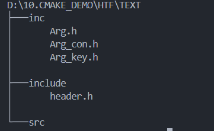
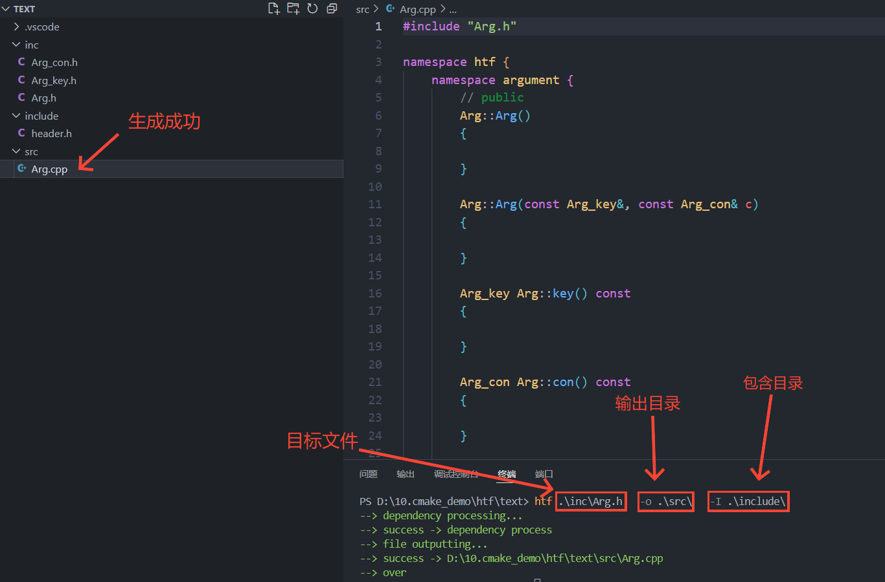
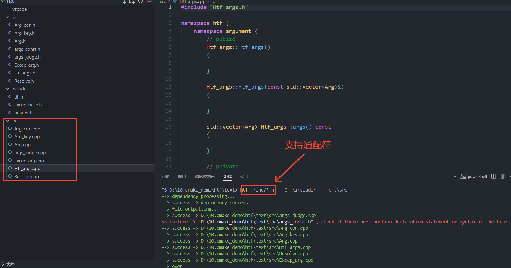

# Header_to_File

> 中文版见 "https://gitee.com/buliangrencpp/Header_to_File.git"

## Introduce
### 1. Main function：
A simple command line tool that automatically generates source files containing corresponding definition statements based on function declaration statements in header files. (This function is referred to as "htf")

### 2. Advantage：
After writing the declaration statement in the C++ header file, without rewriting or copy, a direct instruction generates the corresponding source file containing the definition statement, so as to focus on code implementation

### 3. Feature details and limitations：       
(1) Only header files using **C++ syntax** are supported        
(2) "htf" instructions (detailed below)
>        htf   [-f]   [-i] target_file   [-o output_dir]   [-I include_dir]   

> - Support for wildcard matching paths (currently there are some restrictions, see the last)
> - Similar to the g++ compilation instruction

(3) "htf" function
- Support **handling header file dependencies**
> Currently, only the **#include "xxx"** directive is supported

[example] The directory results are as follows: 
> Arg.h depends on Arg_con.h and Arg_key.h, which in turn depends on header.h. Enter the command "htf Arg.h -I inlcude" and "htf" automatically handles the dependencies



- General function declaration statement
> - Support **namespace identification, custom types**
> - Support **skip definition statements and ignore default values of function parameters**
```cpp
typedef struct{} A;

std::string str(const std::string& s = "", char c = ' ');

std::istream& operator>>(std::istream&, A&);

//  --htf-->  

std::string str(const std::string& s, char c)
{

}

std::istream& operator>>(std::istream&, A&)
{

}
```

- Member functions of a class
> - Supports classification of public, protected, and private functions
```cpp
class A {
public:
    A();
protected:
    char* str_c() const;
public:
    std::string str() const;
private:
    std::string _val;
    void _fic();
};

// --htf-->  

// public
A::A()
{

}

std::string A::str() const
{

}

// protected
char* A::str_c() const
{

}

// private
void A::_fic()
{

}
```

**c.** support namespace 
```cpp
int fic();

namespace A {
    int[] a();
    namespace B {
        int** b();
    }
}

// --htf--> 

int fic()
{

}

namespace A {
    int[] a()
    {

    }

    namespace B {
        int** b()
        {

        }
    }
}
```

- Support **single file, multi-file processing**





- Support a certain degree of **code error prompt**
> This is more left to the IDE(or compiler), and error messages in "htf" are only used when necessary
4. Other functions to be expanded ... ...


## Development information

1. Development platform: VScode under windows
2. Build tool: cmake
3. C++ standard: C++17
4. Source file encoding: UTF-8
5. Test platform: windows
> This tool is cross-platform in terms of code, but has not been formally tested at this time


## Installation tutorial 

### Option 1:
The distribution comes with a compressed "htf-x64_win" package that can be downloaded and unzipped for use
### Option 2:
Built with cmake (g++ compiled)
- Download the source code to a local directory and run it in the "./build/" directory
> cmake .. -G "MinGW Makefiles" -D U=1        
> make install
- The "htf-install" directory is automatically generated. The tool is located in the "htf-install/bin/" directory


### `[suggest]`       

Because this tool uses an instruction call (like g++), it is recommended to add the path of the htf to the environment variable, so that you can then use the instruction to call "htf" in any directory

## "htf" instruction demonstration

### 1. Agreement:
(1) [] : The content in parentheses is optional     
(2) <> : The instruction specified for the program in <>, outside the prompt content        
(3) The default generation mode of the source file: the file name of the generated source file is the same as the header file name, only the extension is different

### 2. Note:
(1) Directory (or path) with Spaces must use English double quotation marks "" included, no space available can not be used 
(2) When the input conflicts with the parameter, please include it with ""      
(3) Enter the line, and click Enter to execute the command      

### 3. Path writing:
> The same as the terminal path, can use  "./", "../"  etc.

### 4. Instruction format:

1. General format
>       <htf>   [<-f>]   [<-i>] header-path   [<-o> output-directory]   [<-I> include-dir]  

2. Parameter meaning
- **-f** : forcible execution       
Because the source file may already exist, in order to avoid the program overwriting the source file, the decision of whether to overwrite is left to the user
> - No "-f": If the source file exists, the system prompts the user whether to overwrite the source file
> - Exists "-f": overwrites the source file regardless of whether it exists

- **-i** : Specifies the target file
> If -i comes after htf, it can be omitted, otherwise it cannot be omitted
> - You can specify multiple existing files
> - Wildcard matches can be used

- **-o** : Specifies the output directory
> - Default current directory
> - Only one existing directory can be specified

- ** -i ** : Specifies the include directory
> Because a header file may "#include header files" in other directories, you need "-I" to specify the include directory to search for the file
> - You can specify multiple existing directories
> - -i The directory where all files are located can be omitted
> - Currently, wildcard matching directories are not supported

> Parameters can be exchanged between positions, except for -o can only have one, other parameters can have multiple

## There are problems at present
#### 1. Wildcard matching problem
> For some reason, there are currently restrictions on wildcard matching
- Currently, directory paths cannot be matched with wildcards, only file paths can be matched
- Can be matched using wildcard characters (*, [...], + ...) **(but currently only wildcard characters are supported in the final file name)**
- '*' : matches any character
> [Example] You can use "./*.h", but you cannot use "./**/file.h"

#### 2. C++ has type recognition problems
> Currently enumerations are used for existing types, but only common types are enumerated. Therefore, for unenumerated types, a warning message is output because it cannot be correctly identified, or it is simply skipped

#### 3. other
- Skip the template classes or functions (since these are usually defined in header files)
- If the program outputs a warning message for a syntactically correct declaration statement, or it is skipped directly, it indicates that the syntax is currently not handled correctly by the program

## Finally
- If you find a bug during use, please contact the developer
- If you have good suggestions for improvement, welcome to discuss